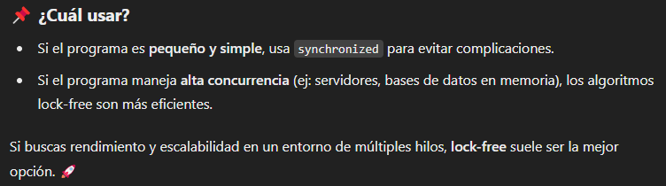

Lock-Free Algorithms is one of the mechanisms in which thread-safe access to shared data is possible without the use of Synchronization
primitives like mutexes. Multi-threaded applications have shared resources that may be passed among different threads used in the application.

- This poses the threat of race conditions and data races among the threads. In order to handle this situation, various techniques are used.
One of the most common ways is to use synchronization and locks(also called monitors) which ensures thread safety. However, If excessive
synchronization is used, the application performance would be hugely impacted along with the application getting more and more complex.

- We need to write applications that are thread-safe but at the same time, they should give us high performance and the benefit of concurrent
execution. So, in order to minimize the usage of synchronization and reduce the complexity of locks, Java has a whole set of classes in the
java.util.concurrent package which provides many advanced operations that are lock-free and atomic.

Hi ha diferents maneres de controlar la concurrencia dels threads.
- Podem utilitzar syncronized per controlar col·lisions, bloquejariem el thread en una secció crita del codi
- Si no utilizem synconized, fariem servir l'algoritme 'look-free' , el qual consisteix en aprofitar les intruccions atomiques que proporciona
 atomicinteger, per aixi evitar l'ús de bloquejos. 
    - Funcionan con el principio de optimistic concurrency: intentan actualizar los datos y, si detectan que otro hilo hizo cambios, 
    reintentan la operación.

**Synchronized:** In Java, it is a mechanism that ensures that only one thread can access a resource at any given time

**join():** detiene la ejecución del hilo principal, NO soluciona los problemas de concurrencia en datos compartidos. 🚀